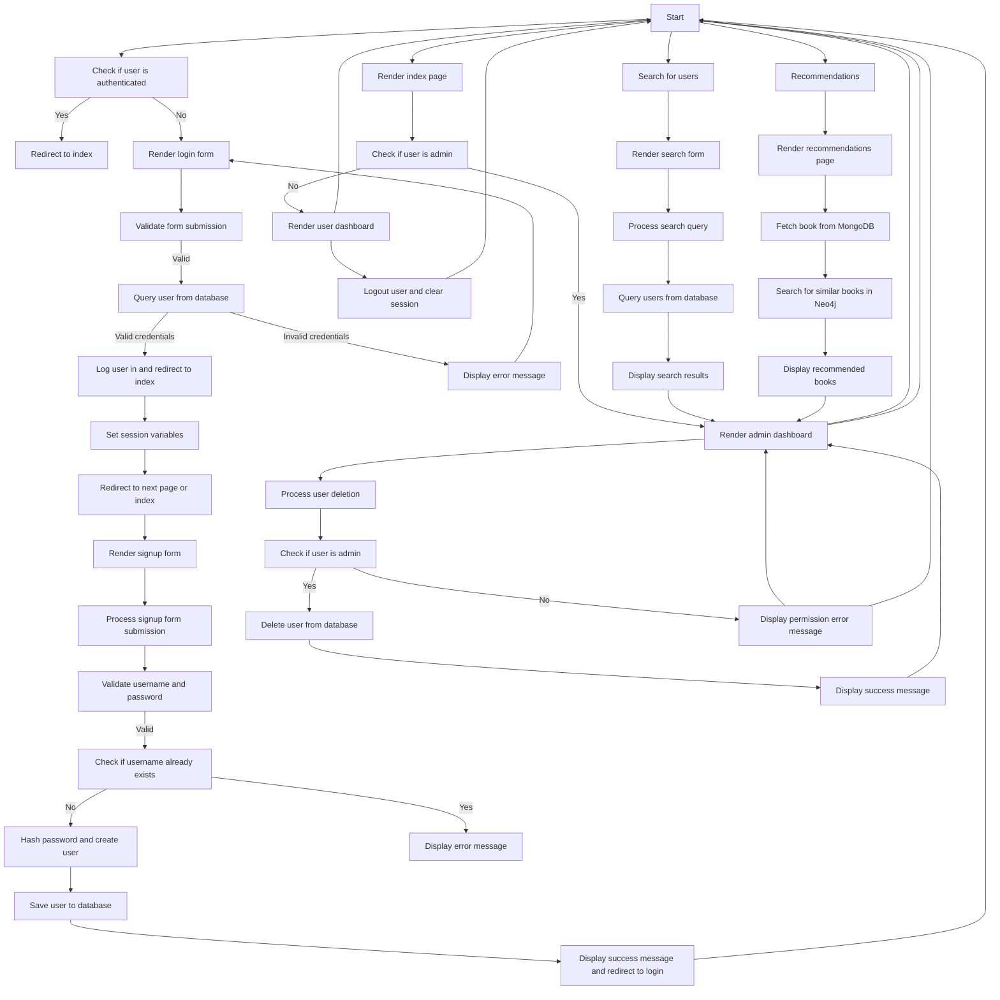

```mermaid
graph TD;

A[Start] --> B[Check if user is authenticated]
B -->|Yes| C[Redirect to index]
B -->|No| D[Render login form]
D --> E[Validate form submission]
E -->|Valid| F[Query user from database]
F -->|Valid credentials| G[Log user in and redirect to index]
G --> H[Set session variables]
H --> I[Redirect to next page or index]
F -->|Invalid credentials| J[Display error message]
J --> D

I --> K[Render signup form]
K --> L[Process signup form submission]
L --> M[Validate username and password]
M -->|Valid| N[Check if username already exists]
N -->|No| O[Hash password and create user]
O --> P[Save user to database]
P --> Q[Display success message and redirect to login]
N -->|Yes| R[Display error message]

Q --> A[Start]

A --> S[Render index page]
S --> T[Check if user is admin]
T -->|Yes| U[Render admin dashboard]
T -->|No| V[Render user dashboard]

U --> A
V --> A

V --> W[Logout user and clear session]
W --> A

U --> X[Process user deletion]
X --> Y[Check if user is admin]
Y -->|Yes| Z[Delete user from database]
Z --> AA[Display success message]
Y -->|No| AB[Display permission error message]

AB --> U

AB --> A
AA --> U

A --> AC[Search for users]
AC --> AD[Render search form]
AD --> AE[Process search query]
AE --> AF[Query users from database]
AF --> AG[Display search results]

AG --> U

A --> AH[Recommendations]
AH --> AI[Render recommendations page]
AI --> AJ[Fetch book from MongoDB]
AJ --> AK[Search for similar books in Neo4j]
AK --> AL[Display recommended books]

AL --> U

U --> A

```